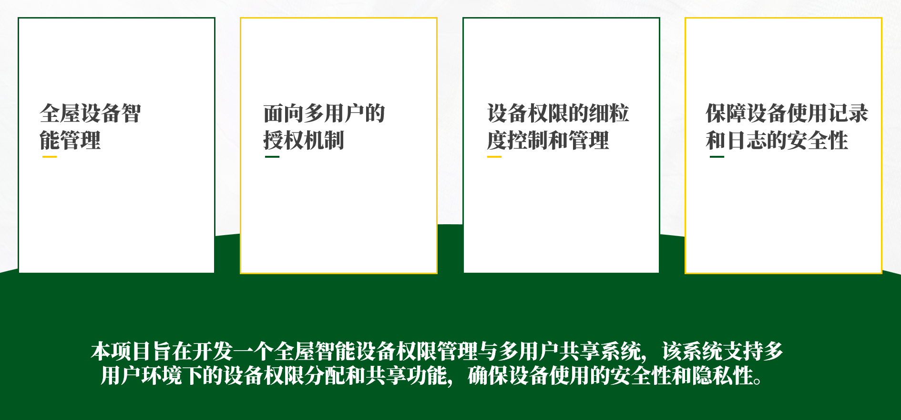

# 背景介绍

## 全屋智能系统概述
全屋智能是通过物联网、人工智能、大数据等先进技术，将家庭中各种设备与系统进行深度集成与互联互通，实现家居环境的智能化管理与控制。随着智能家居设备的普及，单户家庭中往往拥有多个用户，不同用户对不同设备的使用需求和权限需要有所区分。目前市场上的智能家居系统普遍缺乏精细化的多用户权限管理机制，导致安全性和隐私性问题凸显。本系统还集成了先进的大语言模型，使大模型能够安全地调用工具API获取设备信息并执行操作指令，让用户通过自然语言对话方式轻松查看和控制家庭设备，大大提升了系统的易用性和智能化水平。

## 行业现状与趋势
当前智能家居市场呈现快速增长态势。然而，多数智能家居系统仍采用单一账户管理模式，无法满足家庭成员差异化的设备使用需求。随着用户对隐私和安全意识的增强，精细化的设备权限管理成为智能家居发展的必然趋势。同时，大语言模型技术的快速发展为智能家居带来了新的交互范式，通过自然语言理解和对话式交互，使智能家居系统更加直观和人性化。

## 项目意义
本项目旨在开发一个全屋智能设备权限管理与多用户共享系统，通过建立完善的身份认证机制、细粒度权限控制和全面的设备使用记录功能，解决当前智能家居使用中的权限混乱、隐私泄露和安全隐患等问题。该系统将大幅提升智能家居的使用体验和安全性，为不同家庭成员提供个性化的智能家居服务，推动智能家居技术向更加人性化、安全化的方向发展。通过引入基于MCP技术的大语言模型集成方案，系统能够在严格的权限控制框架下理解用户的自然语言指令，实现更智能、更便捷且更安全的设备控制和状态查询，让智能家居真正走入普通家庭的日常生活。

## 技术挑战
多用户身份认证和授权机制的设计是本项目的关键技术难点之一，需要确保用户身份的真实性和合法性。设备权限的细粒度控制和管理也是重大挑战，系统需要根据用户的需求和习惯进行个性化权限分配。同时，设备使用记录和日志的安全性和可靠性也是项目成功的重要保障。

MCP技术允许大模型通过预定义的API接口调用各种工具功能，实现对家庭设备的信息获取和操作控制。与传统的AI集成方案不同，MCP框架特别强调安全性，通过权限验证机制，严格限制大模型的操作权限，确保即使在大模型出现异常的情况下，也不会导致未授权的设备操作。这种"零信任"的安全设计理念，为智能家居系统中的AI应用提供了坚实的安全保障。