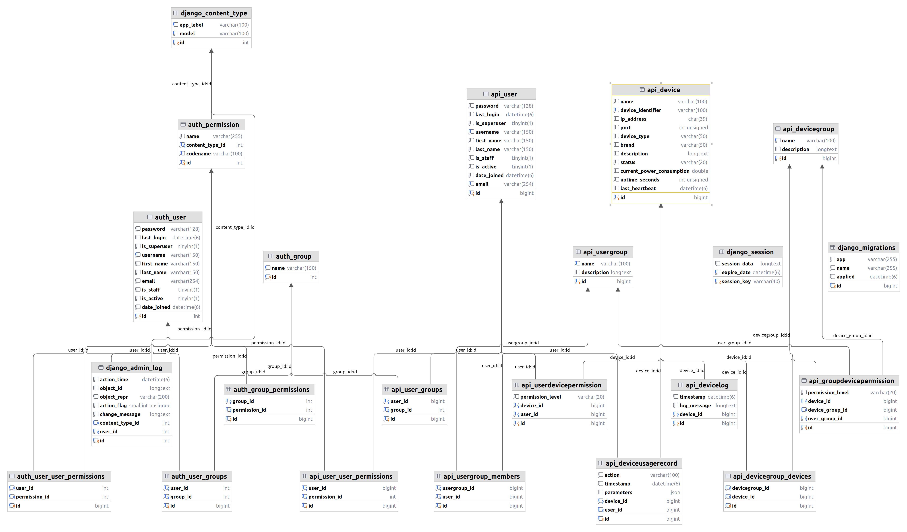

## 数据库设计

初步规划参考下面的代码，ER 图可以在 [https://www.mermaidchart.com/](https://www.mermaidchart.com/)渲染

django 设计：

```python
_# api/models.py
from django.db import models
from django.contrib.auth.models import AbstractUser, Group as AuthGroup, Permission as AuthPermission # Import with aliases

class User(AbstractUser):
    email = models.EmailField(unique=True)
    USERNAME_FIELD = 'email'
    REQUIRED_FIELDS = ['username']

    # Add unique related_name arguments to avoid clashes
    groups = models.ManyToManyField(
        AuthGroup, # Use the aliased Group
        verbose_name='groups',
        blank=True,
        help_text=(
            'The groups this user belongs to. A user will get all permissions '
            'granted to each of their groups.'
        ),
        related_name="api_user_set", # Changed related_name
        related_query_name="user",
    )
    user_permissions = models.ManyToManyField(
        AuthPermission, # Use the aliased Permission
        verbose_name='user permissions',
        blank=True,
        help_text='Specific permissions for this user.',
        related_name="api_user_permissions_set", # Changed related_name
        related_query_name="user",
    )

    def __str__(self):
        return self.email

class UserGroup(models.Model):
    name = models.CharField(max_length=100, unique=True)
    description = models.TextField(blank=True, null=True)
    # Django 的 Group 模型可以用于用户分组，这里我们创建一个新的 UserGroup
    # 如果文档中的 "用户组" 和 Django 的 Group 概念一致，可以考虑直接用 Django Group
    # 或者像这样创建一个新的模型，并通过 ManyToManyField 将 User 和 UserGroup 关联起来
    members = models.ManyToManyField(User, related_name='custom_user_groups', blank=True)
    # created_by = models.ForeignKey(User, related_name='created_user_groups', on_delete=models.SET_NULL, null=True) # 管理员创建

    def __str__(self):
        return self.name

class Device(models.Model):
    DEVICE_STATUS_CHOICES = [
        ('online', '在线'),
        ('offline', '离线'),
        ('error', '故障'),
    ]
    name = models.CharField(max_length=100)
    device_identifier = models.CharField(max_length=100, unique=True, help_text="设备唯一标识，例如 MAC 地址或序列号")
    ip_address = models.GenericIPAddressField(blank=True, null=True)
    port = models.PositiveIntegerField(blank=True, null=True)
    device_type = models.CharField(max_length=50, blank=True, null=True, help_text="例如：空调、冰箱、灯")
    brand = models.CharField(max_length=50, blank=True, null=True)
    description = models.TextField(blank=True, null=True)
    status = models.CharField(max_length=20, choices=DEVICE_STATUS_CHOICES, default='offline')
    current_power_consumption = models.FloatField(blank=True, null=True)
    uptime_seconds = models.PositiveIntegerField(default=0, help_text="运行时间（秒）") # 可以考虑用 DateTimeField 记录上次启动时间
    last_heartbeat = models.DateTimeField(blank=True, null=True)
    # logs 和 usage_records 可以是 TextField 或关联到其他模型
    # logs = models.TextField(blank=True, null=True, help_text="JSON 格式的日志")
    # usage_records = models.TextField(blank=True, null=True, help_text="JSON 格式的使用记录")

    def __str__(self):
        return f"{self.name} ({self.device_identifier})"

class DeviceLog(models.Model): # 更规范的日志记录
    device = models.ForeignKey(Device, related_name='logs', on_delete=models.CASCADE)
    timestamp = models.DateTimeField(auto_now_add=True)
    log_message = models.TextField()

    def __str__(self):
        return f"Log for {self.device.name} at {self.timestamp}"

class DeviceUsageRecord(models.Model): # 更规范的使用记录
    device = models.ForeignKey(Device, related_name='usage_records', on_delete=models.CASCADE)
    user = models.ForeignKey(User, on_delete=models.SET_NULL, null=True, blank=True) # 哪个用户操作的
    action = models.CharField(max_length=100)
    timestamp = models.DateTimeField(auto_now_add=True)
    parameters = models.JSONField(blank=True, null=True) # 操作参数

    def __str__(self):
        return f"{self.user.email if self.user else 'System'} used {self.device.name}: {self.action}"


class DeviceGroup(models.Model):
    name = models.CharField(max_length=100, unique=True)
    description = models.TextField(blank=True, null=True)
    devices = models.ManyToManyField(Device, related_name='device_groups', blank=True)
    # created_by = models.ForeignKey(User, related_name='created_device_groups', on_delete=models.SET_NULL, null=True)

    def __str__(self):
        return self.name

class PermissionLevel(models.TextChoices):
    NONE = 'none', '不可见'
    VISIBLE = 'visible', '可见'
    USABLE = 'usable', '可使用'
    CONFIGURABLE = 'configurable', '可配置'
    MONITORABLE = 'monitorable', '可监视'
    MANAGEABLE = 'manageable', '可管理'

# 用户对单个设备的权限
class UserDevicePermission(models.Model):
    user = models.ForeignKey(User, on_delete=models.CASCADE, related_name='device_permissions')
    device = models.ForeignKey(Device, on_delete=models.CASCADE, related_name='user_permissions')
    # device_group = models.ForeignKey(DeviceGroup, on_delete=models.CASCADE, null=True, blank=True) # 文档中说的是对“设备”的权限，device_group 权限可以通过 UserGroupDevicePermission
    permission_level = models.CharField(max_length=20, choices=PermissionLevel.choices)

    class Meta:
        unique_together = ('user', 'device') # 一个用户对一个设备的权限是唯一的

    def __str__(self):
        return f"{self.user.email} - {self.device.name}: {self.get_permission_level_display()}"

# 用户对设备组的权限
class UserDeviceGroupPermission(models.Model):
    user = models.ForeignKey(User, on_delete=models.CASCADE, related_name='device_group_permissions')
    device_group = models.ForeignKey(DeviceGroup, on_delete=models.CASCADE, related_name='user_permissions')
    permission_level = models.CharField(max_length=20, choices=PermissionLevel.choices)

    class Meta:
        unique_together = ('user', 'device_group') # 一个用户对一个设备组的权限是唯一的

    def __str__(self):
        return f"{self.user.email} - {self.device_group.name}: {self.get_permission_level_display()}"

# 用户组对单个设备/设备组的权限
class GroupDevicePermission(models.Model):
    user_group = models.ForeignKey(UserGroup, on_delete=models.CASCADE, related_name='group_device_permissions')
    device = models.ForeignKey(Device, on_delete=models.CASCADE, null=True, blank=True, related_name='group_permissions')
    device_group = models.ForeignKey(DeviceGroup, on_delete=models.CASCADE, null=True, blank=True, related_name='user_group_permissions')
    permission_level = models.CharField(max_length=20, choices=PermissionLevel.choices)

    class Meta:
        # 一个用户组对一个设备或一个设备组的权限是唯一的 (但不能同时指定 device 和 device_group)
        # 我们可以通过 clean 方法来校验
        unique_together = [
            ('user_group', 'device'),
            ('user_group', 'device_group'),
        ]

    def clean(self):
        from django.core.exceptions import ValidationError
        if self.device and self.device_group:
            raise ValidationError("Cannot assign permission to both a device and a device group simultaneously for a single user group permission entry.")
        if not self.device and not self.device_group:
            raise ValidationError("Must assign permission to either a device or a device group for a user group.")

    def __str__(self):
        target_name = self.device.name if self.device else self.device_group.name
        target_type = "Device" if self.device else "DeviceGroup"
__        return f"Group: {self.user_group.name} - {target_type}: {target_name}: {self.get_permission_level_display()}"_
```

ER 图：

```python
**classDiagram
direction BT
class api_device {
   varchar(100) name
   varchar(100) device_identifier
   char(39) ip_address
   int unsigned port
   varchar(50) device_type
   varchar(50) brand
   longtext description
   varchar(20) status
   double current_power_consumption
   int unsigned uptime_seconds
   datetime(6) last_heartbeat
   bigint id
}
class api_devicegroup {
   varchar(100) name
   longtext description
   bigint id
}
class api_devicegroup_devices {
   bigint devicegroup_id
   bigint device_id
   bigint id
}
class api_devicelog {
   datetime(6) timestamp
   longtext log_message
   bigint device_id
   bigint id
}
class api_deviceusagerecord {
   varchar(100) action
   datetime(6) timestamp
   json parameters
   bigint device_id
   bigint user_id
   bigint id
}
class api_groupdevicepermission {
   varchar(20) permission_level
   bigint device_id
   bigint device_group_id
   bigint user_group_id
   bigint id
}
class api_user {
   varchar(128) password
   datetime(6) last_login
   tinyint(1) is_superuser
   varchar(150) username
   varchar(150) first_name
   varchar(150) last_name
   tinyint(1) is_staff
   tinyint(1) is_active
   datetime(6) date_joined
   varchar(254) email
   bigint id
}
class api_user_groups {
   bigint user_id
   int group_id
   bigint id
}
class api_user_user_permissions {
   bigint user_id
   int permission_id
   bigint id
}
class api_userdevicepermission {
   varchar(20) permission_level
   bigint device_id
   bigint user_id
   bigint id
}
class api_usergroup {
   varchar(100) name
   longtext description
   bigint id
}
class api_usergroup_members {
   bigint usergroup_id
   bigint user_id
   bigint id
}
class auth_group {
   varchar(150) name
   int id
}
class auth_group_permissions {
   int group_id
   int permission_id
   bigint id
}
class auth_permission {
   varchar(255) name
   int content_type_id
   varchar(100) codename
   int id
}
class auth_user {
   varchar(128) password
   datetime(6) last_login
   tinyint(1) is_superuser
   varchar(150) username
   varchar(150) first_name
   varchar(150) last_name
   varchar(254) email
   tinyint(1) is_staff
   tinyint(1) is_active
   datetime(6) date_joined
   int id
}
class auth_user_groups {
   int user_id
   int group_id
   bigint id
}
class auth_user_user_permissions {
   int user_id
   int permission_id
   bigint id
}
class django_admin_log {
   datetime(6) action_time
   longtext object_id
   varchar(200) object_repr
   smallint unsigned action_flag
   longtext change_message
   int content_type_id
   int user_id
   int id
}
class django_content_type {
   varchar(100) app_label
   varchar(100) model
   int id
}
class django_migrations {
   varchar(255) app
   varchar(255) name
   datetime(6) applied
   bigint id
}
class django_session {
   longtext session_data
   datetime(6) expire_date
   varchar(40) session_key
}

api_devicegroup_devices  -->  api_device : device_id:id
api_devicegroup_devices  -->  api_devicegroup : devicegroup_id:id
api_devicelog  -->  api_device : device_id:id
api_deviceusagerecord  -->  api_device : device_id:id
api_deviceusagerecord  -->  api_user : user_id:id
api_groupdevicepermission  -->  api_device : device_id:id
api_groupdevicepermission  -->  api_devicegroup : device_group_id:id
api_groupdevicepermission  -->  api_usergroup : user_group_id:id
api_user_groups  -->  api_user : user_id:id
api_user_groups  -->  auth_group : group_id:id
api_user_user_permissions  -->  api_user : user_id:id
api_user_user_permissions  -->  auth_permission : permission_id:id
api_userdevicepermission  -->  api_device : device_id:id
api_userdevicepermission  -->  api_user : user_id:id
api_usergroup_members  -->  api_user : user_id:id
api_usergroup_members  -->  api_usergroup : usergroup_id:id
auth_group_permissions  -->  auth_group : group_id:id
auth_group_permissions  -->  auth_permission : permission_id:id
auth_permission  -->  django_content_type : content_type_id:id
auth_user_groups  -->  auth_group : group_id:id
auth_user_groups  -->  auth_user : user_id:id
auth_user_user_permissions  -->  auth_permission : permission_id:id
auth_user_user_permissions  -->  auth_user : user_id:id
django_admin_log  -->  auth_user : user_id:id
****django_admin_log  -->  django_content_type : content_type_id:id**
```


