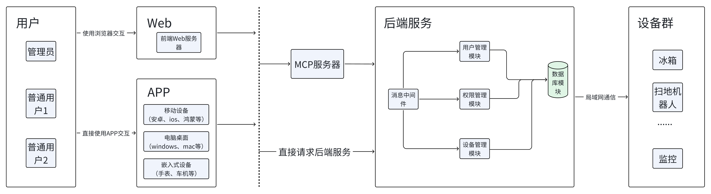
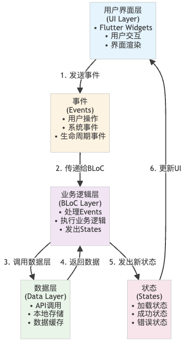
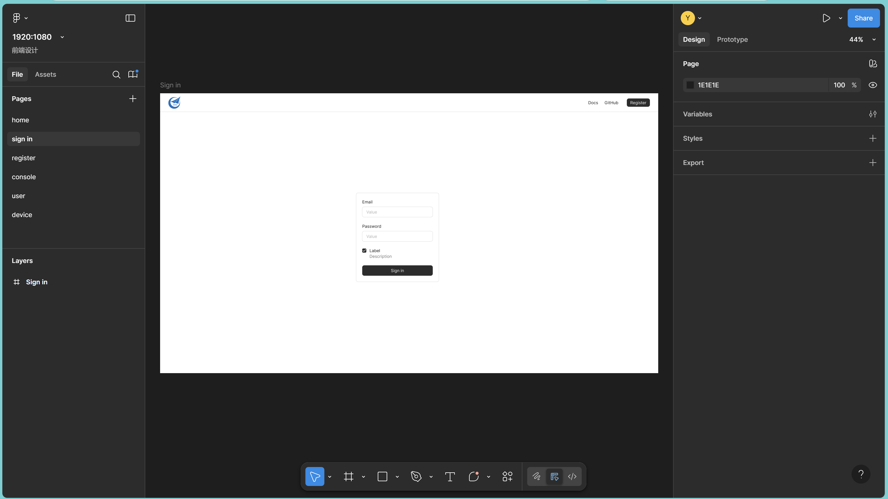
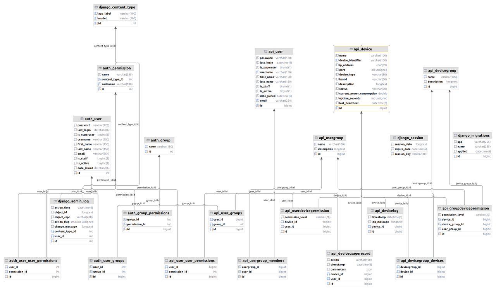
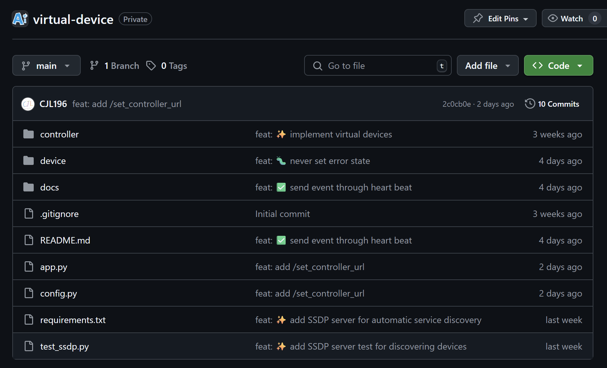
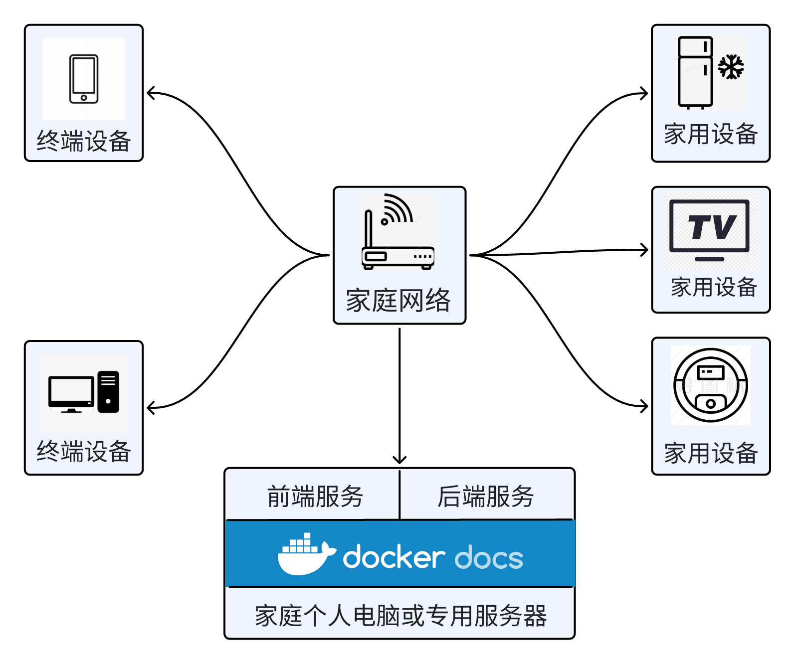
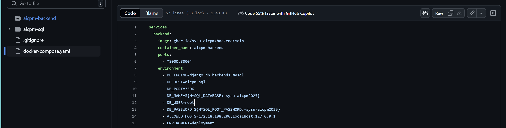
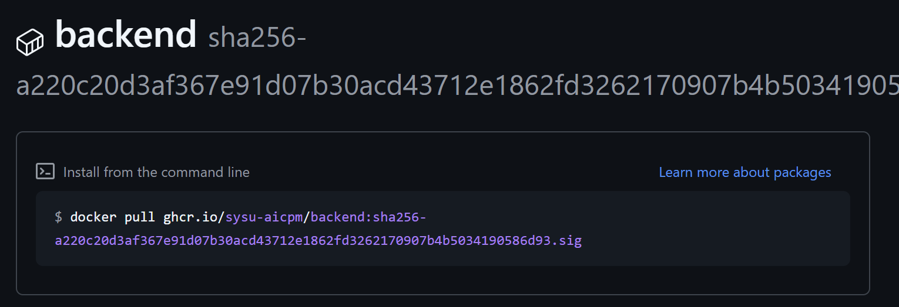
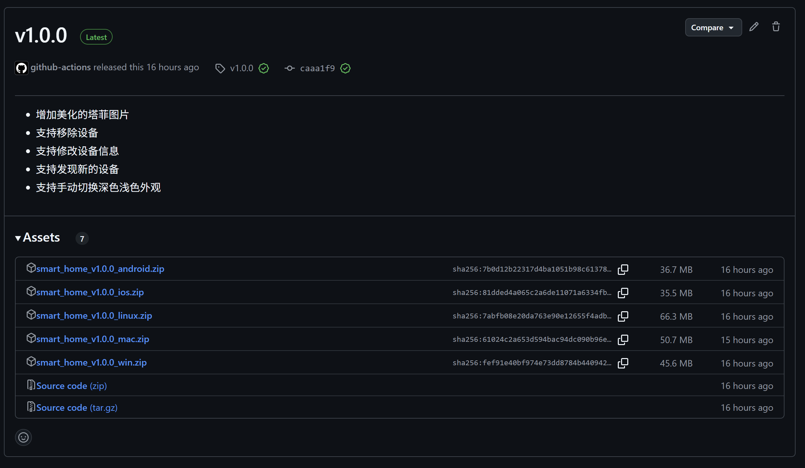
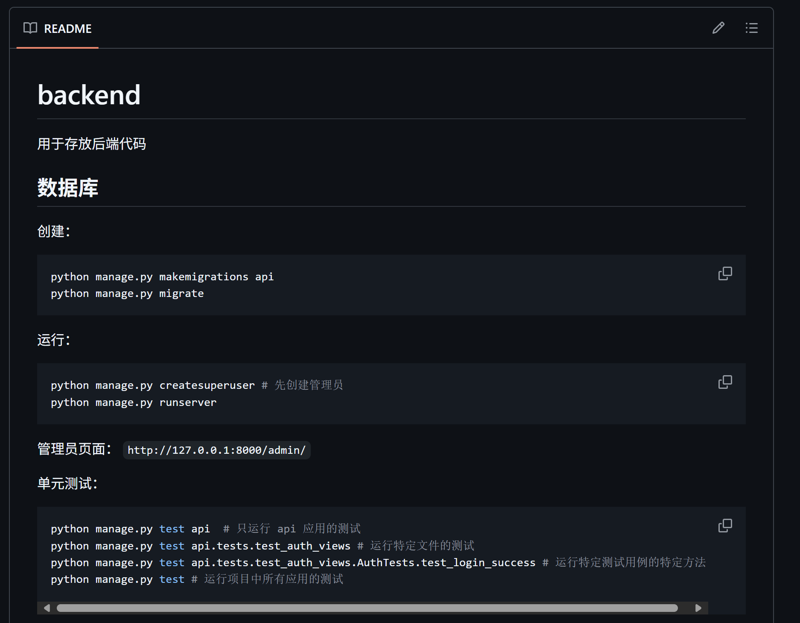

## 软件设计

过程、关键技术、示例图表、数据与功能设计、界面与代码等

## 系统总体架构

系统的总体架构 UML 如上，总体四个区域：



### 用户

- 不同用户拥有不同身份（管理员与普通用户）、不同的权限
- 不同类别的用户使用同一套前端

这个部分严格来讲不属于系统架构部分，只是为了使得图表关系更连贯添加，不过多赘述

### 前端服务

这里我们主要使用了两种技术进行开发，前端的 UI 是使用 Figma 设计

#### Flutter 框架



Flutter 采用 BLoC 响应式架构，具有以下优势：

- 单向数据流：Event → BLoC → State → UI
- 高可测试性：业务逻辑独立于 UI 层
- 代码复用：业务逻辑可被多个 UI 组件复用
- 状态可预测：清晰的事件驱动模型

总之，使用 Flutter 框架开发使得我们的应用具有天然的优点

- 强大的跨平台能力，兼容 Web、移动设备、桌面设备、嵌入式设备
- 不同的访问方式使用一致的 UI，提供一致的使用体验，降低学习成本

#### MCP 服务

严格来讲，这并不属于前端技术，不过我们旨在通过这一技术重构交互方式，所以暂且放在前端部分介绍了

MCP（Model Context Protocol，模型上下文协议）是一种专为大型人工智能模型设计的通信与协作协议，旨在规范和优化多个模型之间在复杂任务处理中的上下文信息交换。该协议通过定义统一的数据结构、交互流程和上下文管理机制，使不同模型能够在多步骤推理、协同生成等场景中保持一致的理解与连贯性。MCP 不仅提升了模型间的互操作性，还增强了系统整体的可解释性和可控性，适用于分布式 AI 系统、模型编排平台以及跨模态任务集成等前沿应用场景。

这使得我们可以结合大语言技术重构 UI，通过聊天控制管理设备，降低学习成本，加速用户交互

#### UI 设计

这里我们使用 Fimga 进行 UI 设计，方便协同工作



### 后端服务

分为用户管理模块、权限管理模块、设备管理模块等，这些模块都基于数据库工作，并通过消息中间件和前端、设备通信。整个项目使用 Django 框架开发。

#### 技术框架（Django）

Django 是一个高级的 Python Web 开发框架，旨在快速构建高效、可维护的网站。它采用了 MTV（模型-模板-视图）设计模式，内置了 ORM、数据库迁移工具、表单处理、认证系统等功能。Django 强调 DRY（Don't Repeat Yourself）原则，提供了强大的管理后台生成工具和丰富的第三方应用支持，适用于从简单到复杂的各类 Web 项目开发。

#### 用户管理模块

比较简单，这里只简单介绍

- 实现用户的身份的判定、登录、注册等服务
- 区分管理员与普通用户

```python
## --- 账户 (Auth) ---
class RegisterView(generics.CreateAPIView):
    queryset = User.objects.all()
    permission_classes = [AllowAny]  ## 注册允许任何人
    serializer_class = RegisterSerializer
    ......
```

#### 权限控制模块

这几乎是整个项目的核心了，我们先从希望的功能点开始讲起（具体详情在需求文档）

- 区分同一用户对不同设备的权限
- 区分不同用户对同一设备的权限
- 为了实现细粒度的权限控制，我们还需要将权限分级，例如对设备可见，可以使用设备等
- 哪怕是对同一设备，行为也需要有敏感与非敏感区分
- 对用户与设备分组

为了实现上面的目标，我们需要借助数据库，尽管各个模块都需要数据库提供服务，但这个模块的任务几乎是完全基于数据库的，而且数据库的大部分表也是为了这一模块服务。



#### 设备管理模块

这个模块主要负责设备的管理与控制，具体如下

- 直接管理设备，向设备发送控制指令
- 收集设备信息、需要对不同设备类型、厂家提供的控制接口做足够的封装
- 记录设备使用日志，方便用户分析使用情况
- 可以 SSDP，mDNS 等技术，发现家庭内的设备

### 设备群

设备通过局域网、蓝牙等方式，被后端服务访问、控制。这部分服务由各个不同的设备产商提供（在本次作业中，我们使用进程模拟各个设备），系统通过后端服务，集成设备、统一管理



## 部署使用视角



对于一个普通的家庭来说，当决定使用我们的系统时，看到的将会是上面这样

我们提供了一些帮助，方便用户部署使用，更加切合家庭的实际场景，让项目可以被真实地使用，而不是停留在代码

- 一键式部署脚本



- 服务端使用 docker 镜像封装，免除环境配置的困扰



- 终端应用打包成 app，提供各个平台的安装包



- 此外我们还提供了足够的文档，方便使用与进一步开发



## 其他

在系统设计的过程中，实际上我们还将工作做了细化与分离，包括接口设计，数据库设计，权限设计等，放在下属文档。为了避免累赘，这里不做介绍
