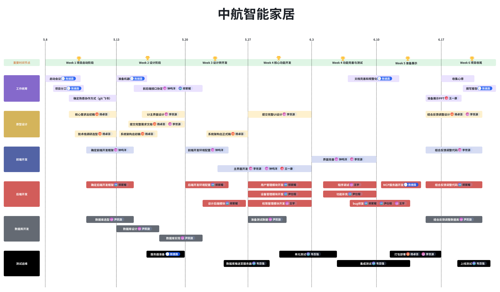
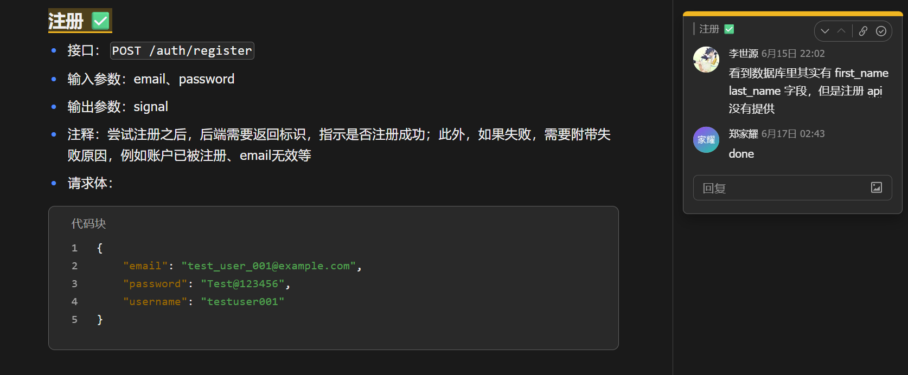

# 项目管理过程与分工情况

## 职责划分

- **工作统筹**: 陈镜霖
- **原型设计**: 杨卓澎, 李世源
- **前端开发**: 钟鸣洋, 李世源
- **文档和 PPT**: 王一康
- **后端开发**: 郑家耀, 尹仕程, 王宇, 陈镜霖
- **数据库开发**: 尹凯旋
- **测试**: 韦百强,
- **部署运维**: 杨卓澎, 李世源

## 时间线

### Week 1: 项目启动阶段 (5.8 ~ 5.12)

- **会议与规划**:

  - `启动会议`: 陈镜霖
  - `项目分工`: 陈镜霖
- **设计与选型**:

  - `核心需求出初稿`: 杨卓澎
  - `技术栈调研选型`: 杨卓澎
  - `确定前后端开发框架`: 钟鸣洋
  - `确定后端开发框架`: 郑家耀

### Week 2: 设计阶段 (5.13 ~ 5.19)

- **设计与文档**:

  - `UI主界面设计`: 李世源
  - `提交完整需求文档`: 杨卓澎, 李世源
  - `系统架构出初稿`: 杨卓澎
- **开发准备**:

  - `准备机器`: 陈镜霖
  - `前后端接口协定`: 钟鸣洋, 郑家耀
  - `数据库选型`: 尹凯旋

### Week 3: 设计转开发 (5.20 ~ 5.26)

- **架构与配置**:

  - `系统架构出正式稿`: 杨卓澎
  - `前端开发环境配置`: 钟鸣洋
  - `后端开发环境配置`: 郑家耀
  - `服务器准备`: 陈镜霖
- **后端与数据库**:

  - `设计后端模块`: 郑家耀
  - `数据库设计与实现`: 尹凯旋

### Week 4: 核心功能开发 (5.27 ~ 6.2)

- **UI 与界面**:

  - `提交完整UI设计`: 李世源
  - `主界面开发`: 李世源, 钟鸣洋, 王一康
- **核心模块开发**:

  - `用户管理模块开发`: 郑家耀
  - `设备管理模块开发`: 尹仕程
  - `权限管理模块开发`: 王宇
- **数据与测试**:

  - `准备测试数据`: 尹凯旋
  - `数据库推送到服务器`: 韦百强
  - `单元测试`: 韦百强

### Week 4 & 5: 功能完善与测试 (6.3 ~ 6.9)

- **完善与修复**:

  - `界面完善`: 钟鸣洋, 李世源
  - `程序测试与功能补充`: 王宇, 尹仕程
  - `Bug修复`: 郑家耀, 尹仕程, 王宇
- **文档与规范**:

  - `文档完善和规范化`: 陈镜霖

### Week 5: 准备演示 (6.10 ~ 6.16)

- **演示准备**:

  - `准备展示PPT`: 王一康
  - `MCP服务器开发`: 陈镜霖
- **测试与部署**:

  - `Bug修复`: 郑家耀, 尹仕程, 王宇
  - `打包部署`: 杨卓澎, 李世源
  - `集成测试`: 韦百强

### Week 6: 项目收尾 (6.17 ~ )

- **总结与报告**:

  - `收集心得`: 全体成员
  - `撰写报告`: 陈镜霖
- **反馈与迭代**:

  - `结合反馈调整设计`: 杨卓澎, 李世源
  - `结合反馈调整代码`: 李世源, 郑家耀
  - `结合反馈调整数据库`: 尹凯旋
- **最终测试**:

  - `上线测试`: 韦百强

## 风险管理

在项目执行过程中，我们识别了以下主要风险并制定了相应的应对策略：

<table>
<tr>
<td>风险描述 </td><td>可能性 </td><td>影响程度 </td><td>应对策略 </td></tr>
<tr>
<td>需求理解偏差 </td><td>中 </td><td>高 </td><td>1. 定期确认需求理解 2. 编写详细的需求文档并获得确认 3. 使用原型快速验证需求理解 </td></tr>
<tr>
<td>技术难点突破 </td><td>高 </td><td>高 </td><td>1. 提前进行技术调研与可行性分析 2. 制定技术备选方案 3. 适时寻求技术指导 </td></tr>
<tr>
<td>进度延误 </td><td>中 </td><td>中 </td><td>1. 合理规划任务与时间缓冲 2. 每周进行进度审核 3. 必要时调整任务优先级 </td></tr>
<tr>
<td>团队成员配合不畅 </td><td>低 </td><td>中 </td><td>1. 建立有效的沟通机制 2. 明确责任分工 3. 定期团队建设活动 </td></tr>
<tr>
<td>系统性能问题 </td><td>中 </td><td>高 </td><td>1. 前期架构设计重视性能因素 2. 定期进行性能测试 3. 预留性能优化时间 </td></tr>
</table>

## 质量保障措施

为确保项目质量，我们采取了以下措施：

1. **代码质量管理**

   - 制定并遵循编码规范
   - 实施代码审查机制
2. **测试策略**

   - 单元测试覆盖核心功能
   - 系统测试确保整体功能正常
   - 用户验收测试确保满足需求
3. **版本控制**

   - 使用 Git 管理源代码
   - 规范提交信息格式
4. **文档管理**

   - 建立统一的文档模板
   - 定期更新项目文档

## 进度监控与报告

项目采用以下机制进行进度监控与报告：

1. **日常进度跟踪**

   - 借助微信、飞书等平台，随时汇报进度与问题
   - 使用任务看板可视化展示任务状态
2. **周进度评审**

   - 每周日下午进行周进度总结会议
   - 回顾本周完成情况，计划下周任务
   - 更新项目燃尽图
3. **里程碑检查点**

   - 每个阶段结束进行里程碑检查
   - 确认交付物质量与完整性
   - 必要时调整后续计划

## 项目变更管理

对于项目过程中出现的需求变更或范围调整，我们制定了以下流程：

1. 提交变更申请，说明变更内容、原因及影响
2. 项目经理评估变更影响（时间、资源、质量）
3. 团队讨论变更可行性与实施方案
4. 变更方案确认后更新项目计划
5. 执行变更并追踪效果

## 团队协作与沟通

### 协作工具

- 代码管理：GitHub
- 文档协作：飞书文档
- 任务管理：飞书多维表格
- 沟通工具：微信群、飞书会议

### 会议机制

- **周总结会**: 每周日晚上，用于总结本周工作、同步整体进度和规划下周任务。
- **线下任务对接**: 每周一、周三的软件工程课上，进行面对面的任务沟通和具体工作安排。
- **技术讨论会**: 根据开发过程中的实际需要随时组织，解决具体技术难题。

### 评论机制

- 为了方便进度监控以及功能维护，我们通过飞书文档提供的评论功能及时交流
- 在提交需求时，添加评论，提醒开发人员
- 在发现 bug 时，添加评论，方便及时维护
- 解决问题或者完成任务后，标记评论为 done，方便监控整体项目进度

飞书文档为团队协作提供了非常大的帮助，成员可以随时在文档中圈点添加评论，提出问题：

## 项目成果与经验总结

### 项目交付物

- 完整的源代码与可执行程序
- 系统部署文档与用户手册
- 设计文档与技术说明
- 测试报告与问题清单

### 经验总结

- 技术选型应考虑团队熟悉度与学习曲线
- 敏捷开发方法在学生项目中的应用效果良好
- 持续集成提高了开发效率与质量
- 前期需求分析与设计的重要性
- 多模块协同开发中的接口规范问题
