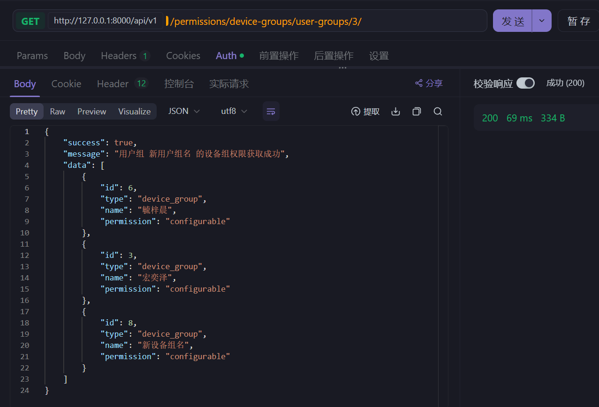

针对后端接口文档提供的接口，使用专业软件(如 postman、Apifox、各种 IDE 插件等)进行接口测试

## 通用

#### 基础 URL：

**本地测试** ` http://localhost:****/api/v1`

**部署测试** ` http://172.18.198.206:8080/api/v1`

#### 请求头(带 Bearer 验证信息)：

```json
{
  "Content-Type": "application/json",
  "Authorization": "Bearer <token>"  // 需要认证的接口
}
```

#### 响应格式

##### 成功响应

```json
{
  "success": true,
  "message": "操作成功",
  "data": {
    // 具体数据内容
  }
}
```

后面若给出了成功响应，都是只包含 `data` 数据项的内容。若没给出，则代表该接口成功响应没有 `data` 数据项。

##### 错误响应

```json
{
  "success": false,
  "message": "错误描述",
  "error_code": "ERROR_CODE",
  "details": {
    // 详细错误信息（可选）
  }
}
```

#### 权限级别定义（暂时）

- `none` - 不可见
- `visible` - 可见
- `usable` - 可使用
- `configurable` - 可配置
- `monitorable` - 可监视
- `manageable` - 可管理

## 账户

### 登录** ✅**

- 接口： `POST /auth/login`
- 输入参数：email、password
- 输出参数：token
- 注释：传入参数账户和密码之后获得 token，用作通行证，后续请求时需附上 token
- 请求体：

```json
{
  "email": "user@example.com",
  "password": "password123"
}
```

- 返回体：

```json
{
  "refresh": "......",  // refresh_token
  "access": "......"
}
```

- 登录成功 (不需要 username)


- 邮箱不存在

```json
{
    "success": false,
    "message": "找不到指定凭据对应的有效用户",
    "error_code": "no_active_account"
}
```

- 密码错误

同上

### 注册** ✅**

- 接口：`POST /auth/register`
- 输入参数：email、password
- 输出参数：signal
- 注释：尝试注册之后，后端需要返回标识，指示是否注册成功；此外，如果失败，需要附带失败原因，例如账户已被注册、email 无效等
- 请求体：

```json
{
    "email": "test_user_001@example.com",
    "password": "Test@123456",
    "username": "testuser001"
}
```

- 返回体（测试）:

```json
{
  "success": true,
  "message": "注册成功，请登录。"
}
```

- 注册成功


- 名称占用 (400)

```json
{
    "success": false,
    "message": "注册失败: 已存在一位使用该名字的用户。",
    "error_code": "VALIDATION_ERROR",
    "details": {
        "username": [
            "已存在一位使用该名字的用户。"
        ]
    }
}
```

- 邮箱占用 (400)

```json
{
    "success": false,
    "message": "注册失败: 该邮箱已被注册。",
    "error_code": "VALIDATION_ERROR",
    "details": {
        "email": [
            "该邮箱已被注册。"
        ]
    }
}
```

- 名称和邮箱同时占用
- Message 仅传告邮箱被注册

```json
{
    "success": false,
    "message": "注册失败: 该邮箱已被注册。",
    "error_code": "VALIDATION_ERROR",
    "details": {
        "email": [
            "该邮箱已被注册。"
        ],
        "username": [
            "已存在一位使用该名字的用户。"
        ]
    }
}
```

- 密码没有级别要求（如 " 1 " 可作为密码）

### 更改（暂未实现）

- 接口：`PUT `
- 输入参数：info_dict
- 注释：尝试更改个人信息，输入一个字典，字典的 key 对应需要修改的对象，例如呢称、邮箱、密码等，value 对应新的值
- 请求头：需要 user_token
- 请求体

```json
{
}
```

### 刷新令牌** ✅**

- 接口：`POST /auth/``re``fresh`
- 输入参数：refresh_token
- **接口错误已修复！**


##### **错误**~~总结：~~

~~根据测试情况，请求体不可为空；同时根据测试空请求体的返回体提示："refresh"必需。进一步测试发现，补足"refresh"参数后，报错如右~~

- **测试成功**，需要登陆时返回体的 refresh 字段：


### 获取全部用户** ✅**

- 接口：`GET /auth/all`
- 输入参数：admin_token
- 注释：管理员调用获取全部用户信息
- 测试在本地进行
- 测试成功


- 管理员令牌无效

```json
{
    "success": false,
    "message": "此令牌对任何类型的令牌无效",
    "error_code": "token_not_valid",
    "details": {
        "detail": "此令牌对任何类型的令牌无效",
        "code": "token_not_valid",
        "messages": [
            {
                "token_class": "AccessToken",
                "token_type": "access",
                "message": "Token is invalid"
            }
        ]
    }
}
```

### 验证令牌有效** ✅**

- 接口：`POST /auth/verify`
- 输入参数 user_token
- 注释：这个 token 不是放在 Authorization 头中，而是在请求体中以 JSON 格式发送

```json
{
    "token":"<user token>"
}
```

- 令牌有效


- 令牌无效

```json
{
    "success": false,
    "message": "Token is invalid",
    "error_code": "token_not_valid",
    "details": {
        "detail": "Token is invalid",
        "code": "token_not_valid"
    }
}
```

- 请求体违规

```json
{
    "success": false,
    "message": "该字段是必填项。",
    "error_code": "GENERIC_ERROR",
    "details": {
        "token": [
            "该字段是必填项。"
        ]
    }
}
```

## 权限

### 对设备

#### 查看用户对设备的权限** ✅**

- 接口：`GET /permissions/user/{user_id}`
- 输入参数：admin_token、user_email（或者 user_id）
- 输出参数：list<info_dict>
- 注释：管理员传入自己的 token，查看某用户对于所有设备的权限。返回一个 list，list 的每个元素都是 dict，dict 的 key 包括：【类型】（用于指示某个设备是真实设备还是设备组）、【名】（设备名或者设备组名）、【权限】
- 请求头：需要 admin_token
- 返回体：

```json
[
  {
    "id":6,
    "type":"device",  // 设备都是固定值
    "name":"客厅空调",
    "permission":"configurable"
  },
  ......
]
```

- 测试成功


- 当未给一个用户赋予任何权限时，返回体如下：

```json
{
    "success": true,
    "message": "用户 irescp_lqd89@outlook.com 的设备权限获取成功",
    "data": []
}
```

_应该设置一个默认权限更符合现实，不过这个缺陷可接受，可忽略。_

前端认为默认权限为 none 级别处理

#### 修改用户对设备的权限** ✅**

- 接口：`PUT /permissions/user/{user_id}`
- 输入参数：admin_token、device_id、target_permission
- 输出参数：signal
- 注释：管理员传入自己的 token，设置某用户对于指定设备的权限；返回是否成功的标识。
- 请求头：需要 admin_token
- 请求体：

```json
{
  "device_id": 6,
  "permission_level": "configurable"
}
```

- 首次服务一个用户权限，返回体如下：

```json
{
    "success": true,
    "message": "用户对设备的权限已创建。"
}
```

- 再次对该用户变更权限，返回体如下:

```json
{
    "success": true,
    "message": "用户对设备的权限已更新。"
}
```

- user_id 不存在，返回体如下：

```json
{
    "success": false,
    "message": "No User matches the given query.",
    "error_code": "GENERIC_ERROR"
}
```

#### 查看用户组对设备的权限** ✅**

- 接口：`GET /permissions/user-groups/{group_id}`
- 输入参数：admin_token
- 输出参数：list<info_dict>
- 注释：管理员传入自己的 token，查看某用户组对于所有设备的权限。返回一个 list，list 的每个元素都是 dict，dict 的 key 包括【类型】（用于指示某个设备是真实设备还是设备组）、【名】（设备名或者设备组名）、【权限】
- 请求头：需要 admin_token
- 返回体：

```json
{}
```

- 未设置权限前，返回体如下：

```python
{
    "success": true,
    "message": "用户组 xxx 的权限获取成功",
    "data": []
}
```

- 设置权限后，返回体如下：

```json
{
    "success": true,
    "message": "用户组 新用户组名 的权限获取成功",
    "data": [
        {
            "id": 3,
            "type": "device",
            "name": "冰箱2",
            "permission": "configurable"
        },
        {
            "id": 4,
            "type": "device",
            "name": "空调1",
            "permission": "configurable"
        }
        
        ......
    ]
}
```

- 测试成功


#### 修改用户组对设备的权限** ✅**

- 接口：`PUT /permissions/user-groups/{group_id}`
- 输入参数：admin_token、device_id、target_permission
- 输出参数：signal
- 注释：管理员传入自己的 token，设置某用户对于指定设备的权限；返回是否成功的标识。
- 请求头：需要 admin_token
- 请求体：

```json
{
  "device_id": 6,
  "permission_level": "configurable"
}
```

- 首次修改权限，返回体如下：

```json
{
    "success": true,
    "message": "用户组权限已创建。"
}
```

- 更新权限，返回体如下：

```python
{
    "success": true,
    "message": "用户组权限已更新。"
}
```

- 测试成功


### 对设备组

#### 查看用户对设备组的权限** ✅**

- 接口：`GET /permissions``/device-``group``s``/user/{user_id}`
- 输入参数：admin_token、user_email（或者 user_id）
- 输出参数：list<info_dict>
- 注释：管理员传入自己的 token，查看某用户对于所有设备的权限。返回一个 list，list 的每个元素都是 dict，dict 的 key 包括：【类型】（用于指示某个设备是真实设备还是设备组）、【名】（设备名或者设备组名）、【权限】
- 请求头：需要 admin_token
- 返回体：

```json
[
  {
    "id":6,
    "type":"device_type",  // 设备组都是固定值
    "name":"客厅空调",
    "permission":"configurable"
  },
  ......
]
```

- 测试成功


#### 修改用户对设备组的权限** ✅**

- 接口：`PUT /permissions``/device-``group``s``/user/{user_id}`
- 输入参数：admin_token、device_group_id、target_permission
- 输出参数：signal
- 注释：管理员传入自己的 token，设置某用户对于指定设备的权限；返回是否成功的标识。
- 请求头：需要 admin_token
- 请求体：

```json
{
  "device_group_id": 6,
  "permission_level": "configurable"
}
```

- 首次赋予用户对设备组的权限时，返回体如下：

```json
{
    "success": true,
    "message": "用户对设备组的权限已创建。"
}
```

- 更新权限，返回体如下：

```json
{
    "success": true,
    "message": "用户对设备组的权限已更新。"
}
```

- 测试成功


#### 查看用户组对设备组的权限** ✅**

- 接口：`GET /permissions``/device-``group``s``/``user-``group``s``/{group_id}`
- 输入参数：admin_token
- 输出参数：list<info_dict>
- 注释：管理员传入自己的 token，查看某用户组对于所有设备组的权限。返回一个 list，list 的每个元素都是 dict，dict 的 key 包括【类型】（用于指示某个设备是真实设备还是设备组）、【名】（设备名或者设备组名）、【权限】
- 请求头：需要 admin_token
- 返回体：

```json
{
    "success": true,
    "message": "用户组 xxx 的设备组权限获取成功",
    "data": [
        {
            "id": 6,
            "type": "device_group",
            "name": "xxx",
            "permission": "xxx"
        },
        {
            "id": 3,
            "type": "device_group",
            "name": "宏奕泽",
            "permission": "configurable"
        },
        
        ......
    ]
}
```

- 测试成功



#### 修改用户组对设备组的权限** ✅**

- 接口：`PUT /permissions``/device-``group``s``/``user-``group``s``/{group_id}`
- 输入参数：admin_token、device_group_id、target_permission
- 输出参数：signal
- 注释：管理员传入自己的 token，设置某用户对于指定设备的权限；返回是否成功的标识。
- 请求头：需要 admin_token
- 请求体：

```json
{
  "device_group_id": 6,
  "permission_level": "configurable"
}
```

- 首次赋予和再次更新权限，返回体均如下：

```json
{
  "success": true,
  "message": "用户组对设备组的权限已更新。"
}
```

- 测试成功


## 用户组

### 创建用户组** ✅**

- 接口：`POST /user-groups`
- 输入参数：admin_token、group_name
- 输出参数：signal
- 注释：由管理员调用，用于创建组，返回创建结果，并附加合适的说明
- 请求头：需要 admin_token
- 请求体：

```json
{
  "name": "新用户组",
  "description": "用户组描述"
}
```

- 创建成功，返回体如下：

```json
{
    "id": 1,
    "name": "新用户组",
    "description": "用户组描述",
    "members": [],
    "members_count": 0
}
```

- 用户组名已存在，返回体如下：

```json
{
    "success": false,
    "message": "具有 name 的 user group 已存在。",
    "error_code": "GENERIC_ERROR",
    "details": {
        "name": [
            "具有 name 的 user group 已存在。"
        ]
    }
}
```

### 删除用户组 **✅**

- 接口：`DELETE /user-groups/{group_id}`
- 输入参数：admin_token
- 输出参数：signal
- 注释：

  - 由管理员调用，用于删除用户组，返回执行结果，并附加合适的说明。
  - 需要删除与之相关的所有用户以及与之相关的设备组才能正常执行，否则失败。
  - （可选需求，未实现）不允许删除特定用户组
- 请求头：需要 admin_token
- 请求体：（空）

```json
{}
```

- 返回状态码 200
- 返回体：

```json
{
    "success": **true**,
    "message": "用户组 0611 已成功删除"
}
```

- 测试成功


### 修改用户组名** ✅**

- 接口：`PUT /user-groups/{group_id}`
- 输入参数：admin_token、new_group_name
- 输出参数：signal
- 注释：管理员调用，用于修改用户组名
- 请求头：需要 admin_token


- 请求体：

```json
{
  "name": "新用户组名",
  "description": "新的用户组描述"
}
```

- 返回体：

```json
{
    "id": 3,
    "name": "新用户组名",
    "description": "新的用户组描述",
    "members": [],
    "members_count": 0
}
```


- 测试成功


### 加入用户到其他组** ✅**

- 接口：`POST /user-groups/{group_id}/members`
- 输入参数：admin_token、user_email（或者 user_id）、target_group_id
- 输出参数：signal
- 注释：管理员传入自己的 token，将用户加入到指定组；返回是否成功的标识。
- 请求头：需要 admin_token
- 请求体：

```json
{
  "user_id": 11
}
```

- 返回体：

```json
{
    "success": true,
    "message": "用户 XXX 已加入用户组 XXX"
}
```

- 测试成功


- 用户组 id 不存在，返回体如下：

```json
{
    "success": false,
    "message": "No UserGroup matches the given query.",
    "error_code": "GENERIC_ERROR"
}
```

### 从组中移除用户** ✅**

- 接口：`DELETE /user``-``groups/{group_id}/members/{user_id}`
- 输入参数：admin_token、user_email（或者 user_id）、target_group_id
- 输出参数：signal
- 注释：管理员传入自己的 token，将用户移出指定组；如果用户从 public 组中移除，删除用户；返回是否成功的标识。
- 请求头：需要 admin_token
- 返回体：

```json
{
    "success": **true**,
    "message": "用户 test1@test.com 已从用户组 0611 移除"
}
```

- 测试成功


- 若用户不在用户组中，返回体如下：

```json
{
    "success": false,
    "message": "用户 wweibq@qq.com 不在用户组 新用户组名 中",
    "error_code": "USER_NOT_IN_GROUP"
}
```

## 设备组

### 创建设备组** ✅**

- 接口：`POST /device-groups`
- 输入参数：admin_token、group_name
- 输出参数：signal
- 注释：由管理员调用，用于创建组，返回创建结果，并附加合适的说明
- 请求头：需要 admin_token
- 请求体：

```json
{
  "name": "客厅设备组",   // 必填
  "description": "客厅所有智能设备"   // 选填
}
```

- 返回体：

```json
{
  "id":13,
  "name":"test1",
  "description":null,
  "devices":[],
  "devices_count":0
}
```

- 测试成功


### 删除设备组 **✅**

- 接口：`DELETE /device-groups/{``group``_id}`
- 输入参数：admin_token
- 输出参数：signal
- 注释：

  - 由管理员调用，用于删除设备组，返回执行结果，并附加合适的说明
  - 需要移除设备组内所有设备，所有与之相关的用户权限和用户组权限后才能执行成功。否则执行失败
  - (可选功能，未实现) 不允许删除特定设备组
- 请求头：需要 admin_token
- 请求体：（空）

```json
{}
```

- 返回体:

```json
{
    "success": **true**,
    "message": "设备组 D502 已成功删除"
}
```

- 测试成功


### 查询设备组** ✅**

- 接口: `GET /device-groups`
- 输入参数: admin_token
- 输出参数：
- 注释：由管理员调用，用于查询所有设备组，返回执行结果，并附加合适的说明
- 请求头：需要 admin_token
- 返回体

  ```json
  ```

{
"count": 13,
"next": **null**,
"previous": **null**,
"results": [
{
"id": 1,
"name": "crazy",
"description": "crrazzy",
"devices": [],
"devices_count": 0
},
// ...
]
}

```

- 测试成功


### 修改设备组名** ✅**

- 接口：`PUT /device-groups/{group_id}`

- 输入参数：admin_token、group_ip、new_group_name

- 输出参数：signal

- 注释：管理员调用，用于修改用户组名

- 请求头：需要admin_token

- 请求体：

```json
{
  "name": "新设备组名",  // 必填
  "description": "新的设备组描述"  // 选填
}
```

- 返回体：

```json
{
  "id": "1",
  "name": "新设备组名"
  "description": "新的设备组描述",
  "devices_count": 0
}
```


- 测试成功


### 加入设备到其他组** ✅**

- 接口：`POST /device-groups/{group-id}/devices`
- 输入参数：admin_token、device_id、target_group_id
- 输出参数：signal
- 注释：管理员传入自己的 token，将设备加入到指定组；返回是否成功的标识。
- 请求头：需要 admin_token
- 请求体：

```json
{
  "device_id": 1
}
```

- 返回体：

```python
{
    "success": true,
    "message": "设备 xxx 已加入设备组 xxx"
}
```

- 测试成功


_已经加入的设备反复进行加入操作无提示_

### 从组中移除设备** ✅**

- 接口：`DELETE /device-groups/{group_id}/devices/{device_id}`
- 输入参数：admin_token、device_id、target_group_id
- 输出参数：signal
- 注释：管理员传入自己的 token，将设备移出指定组；如果设备从 public 组中移除，删除设备；返回是否成功的标识。
- 请求头：需要 admin_token
- 在设备组中找不到设备（包括 id 不存在），返回体如下：

```json
{
    "success": false,
    "message": "未找到。",
    "error_code": "GENERIC_ERROR"
}
```

- 测试成功


## 设备

### 发现设备 **✅**

- 接口：`GET /devices/discover`
- 输入参数：admin-token
- 输出参数：list[device]
- 注释：

  - 管理员尝试发现附近设备，后端服务检查周围是否有设备，返回一个 list.
  - list 中的每个元素都是一个用于设备信息的 dict，dict 至少要包含【设备名】、【设备 ip】、【设备类型】、【设备标识】等信息
- 请求头：需要 admin_token
- 若存在设备，类似的返回体如下：

```json
"success": **true**,
    "message": "通过SSDP发现 2 个设备",
    "data": [
        {
            "device_identifier": "eb370a3c-b9dc-42bf-a0fb-61e311c6d79c",
            "name": "refrigerator (eb370a3c-b9dc-42bf-a0fb-61e311c6d79c)",
            "ip": "127.0.0.1",
            "port": 5001,
            "device_type": "refrigerator",
            "status": "off",
            "power": 100,
            "ssdp_location": "http://0.0.0.0:5001",
            "ssdp_nt": "urn:schemas-example-com:device:refrigerator:1",
            "ssdp_usn": "uuid:eb370a3c-b9dc-42bf-a0fb-61e311c6d79c::urn:schemas-example-com:device:refrigerator:1",
            "already_added": **false**,
            "database_id": **null**
        },
        {
            "device_identifier": "e7f4fe33-e201-47f4-943b-16b3fe97bbcf",
            "name": "refrigerator (e7f4fe33-e201-47f4-943b-16b3fe97bbcf)",
            "ip": "127.0.0.1",
            "port": 5000,
            "device_type": "refrigerator",
            "status": "off",
            "power": 100,
            "ssdp_location": "http://0.0.0.0:5000",
            "ssdp_nt": "urn:schemas-example-com:device:refrigerator:1",
            "ssdp_usn": "uuid:e7f4fe33-e201-47f4-943b-16b3fe97bbcf::urn:schemas-example-com:device:refrigerator:1",
            "already_added": **true**,
            "database_id": 6
        }
    ]
}
```

- 管理员令牌无效，返回之前同样的返回体
- 若无设备，则返回体如下

```json
{
    "success": true,
    "message": "未通过SSDP发现任何兼容设备",
    "data": []
}
```

### 同步设备**✅**

- 接口：`POST /devices/sync`
- 输入参数：admin-token
- 输出参数：
- 注释：

  - 将发现设备返回的结果传入，可以将设备添加到数据库中
- 请求体：

```json
{
    "device_data": [
        {
            "device_identifier": "b067db59-7194-47a1-8a24-ebdfeb9fcb61",
            "name": "refrigerator (b067db59-7194-47a1-8a24-ebdfeb9fcb61)",
            "ip": "127.0.0.1",
            "port": 5001,
            "device_type": "refrigerator",
            "status": "off",
            "power": 100,
            "ssdp_location": "http://127.0.0.1:5001",
            "ssdp_nt": "urn:schemas-example-com:device:refrigerator:1",
            "ssdp_usn": "uuid:b067db59-7194-47a1-8a24-ebdfeb9fcb61::urn:schemas-example-com:device:refrigerator:1",
            "already_added": false,
            "database_id": null
        }
    ]
}
```

- 返回体：

```json
{
    "success": true,
    "message": "成功同步 1 个设备",
    "data": {
        "synced_devices": [
            {
                "action": "created",
                "device_id": 4,
                "device_identifier": "b067db59-7194-47a1-8a24-ebdfeb9fcb61"
            }
        ],
        "errors": [],
        "total_processed": 1,
        "successful": 1,
        "failed": 0
    }
}
```

- 测试成功


- 若管理员令牌无效，返回之前同样的返回体

### 添加设备** ✅**

- 接口：`POST /devices`
- 输入参数：admin-token、device
- 输出参数：signal
- 注释：管理员尝试在发现设备之后添加设备，返回是否成功的标识，如果失败，需要返回足够错误信息。这里我们做一些简单假设，新的设备可以通过 ip 和 port 标识
- 请求头：需要 admin-token
- 请求体：

```json
{
    "device_ip": "10.0.1.1",
    "device_port": "2100"
}
```

- 返回体：

```json
{
    "success": true,
    "message": "设备添加成功",
    "data": {
        "id": 6,
        "name": "New Device (10.0.1.1:2100)",
        "device_identifier": "10.0.1.1:2100",
        "ip_address": "10.0.1.1",
        "port": 2100,
        "device_type": null,
        "brand": null,
        "description": null,
        "status": "offline",
        "current_power_consumption": null,
        "uptime_seconds": 0,
        "last_heartbeat": null
    }
}
```

- 若管理员令牌无效，返回之前同样的返回体
- ~~信息有点少。   更新：搭配修改设备信息接口可以完成，解决~~

##### 

### 移除设备** ✅**

- 接口：`DELETE /devices/{device_id}`
- 输入参数：admin-token、device
- 输出参数：signal
- 注释：管理员尝试移除设备，返回是否成功的标识，如果失败，需要返回足够错误信息。
- 请求头：需要 admin-token
- 请求体：

```json
{
}
```

- 移除成功，返回体：

```json
{
    "success": true,
    "message": "设备移除成功"
}
```

- id 不在范围内，返回体:

```json
{
    "success": false,
    "message": "No Device matches the given query.",
    "error_code": "GENERIC_ERROR"
}
```

### 修改设备信息** ✅**

- 接口：`PUT /devices/{device_id}`
- 输入参数：admin-token、device_id、new_device_info
- 输出参数：signal
- 注释：管理员尝试修改设备信息，传入设备 id 和新的设备信息，设备信息可以包括【设备名】、【设备描述】、【设备品牌】等
- 请求头：需要 admin-token
- 请求体：

```json
{
    "device_info": {
        "name": "fridge1",
    }
}
```

- 测试成功


- 经过测试，如下的信息（参数）可以被添加

```json
{
    "device_info": {
        "name": "",
        "ip_address": "",
        "port": 5001,
        "device_type": "",
        "brand": "",
        "description": ""
    }
}
```

- 添加其他信息，返回体提示错误（会提示不支持的键）：

```json
{
    "success": false,
    "message": "设备信息修改失败",
    "error_code": "VALIDATION_ERROR",
    "details": {
        "device_info": [
            "不支持的键: id in device_info."
        ]
    }
}
```

### 控制设备** ✅**

- 接口：`POST /devices/{device_id}/control`
- 输入参数：token、device_id、action、param
- 输出参数：signal
- 注释：尝试控制设备，需要上传通行证（token）、设备唯一标识（device_id）、对设备的操作（action）（例如开机、关机等）、附带的参数（比如控制空调时也许需要温度之类的参数）；后端需要通过 token 检查用户是否合法，用户对于指定设备进行的操作是否具有足够权限。返回是否成功的标识，或者其他 http 状态码，另外需要附带足够的错误信息。
- 请求头：需要 user_token
- 请求体：

```json
{
  "action": "set_temperature",
  "parameters": {
    "temperature": -1
  }
}
```

- 模拟一个监听 `5002` 的设备 冰箱 2 （id : 3）

```python
from http.server import BaseHTTPRequestHandler, HTTPServer
import json

class MockDeviceHandler(BaseHTTPRequestHandler):
    def do_POST(self):
        ## 获取请求头中的数据长度
        content_length = int(self.headers['Content-Length'])
        ## 读取请求体
        post_data = self.rfile.read(content_length)
        
        ## 设置响应头
        self.send_response(200)
        self.send_header('Content-type', 'application/json')
        self.end_headers()

        ## 返回通用响应体（success + message）
        response = {
            "success": True,
            "message": "操作已接收",
        }
        self.wfile.write(json.dumps(response).encode('utf-8'))

def run(server_class=HTTPServer, handler_class=MockDeviceHandler, port=5002):
    server_address = ('', port)
    httpd = server_class(server_address, handler_class)
    print(f"模拟设备服务正在运行在端口 {port}...")
    httpd.serve_forever()

if __name__ == "__main__":
    run()
```

- 设备 id 不存在，返回体如下：

```json
{
    "success": false,
    "message": "未找到。",
    "error_code": "GENERIC_ERROR"
}
```

- 所请求控制的设备故障或者离线，返回体如下：

```json
{
    "success": false,
    "message": "无法与设备 空调1 通信: 设备控制超时: 1.1.1.11:41",
    "error_code": "DEVICE_COMMUNICATION_FAILED"
}
```

- 有权限且设备运行中，如下：


- 使用 查询设备详情 接口，查看温度设置。成功设置。

```json
{
    "success": true,
    "message": "设备详情获取成功",
    "data": {
        "id": 3,
        "name": "冰箱2",
        "device_identifier": "2",
        "ip_address": "127.0.0.1",
        "port": 5002,
        "device_type": "refrigerator",
        "brand": null,
        "description": "",
        "status": "online",
        "current_power_consumption": 1000.0,
        "uptime_seconds": 4294967295,
        "last_heartbeat": null,
        "logs": [],
        "usage_records": [
            {
                "user_email": "wweibq@qq.com",
                "action": "set_temperature",
                "timestamp": "2025-06-14T21:30:51.387538+08:00",
                "parameters": {
                    "temperature": -1
                }
            },
            {
                "user_email": "wweibq@qq.com",
                "action": "set_temperature",
                "timestamp": "2025-06-14T21:37:40.173701+08:00",
                "parameters": {
                    "temperature": -5
                }
            },
            {
                "user_email": "wweibq@qq.com",
                "action": "set_temperature",
                "timestamp": "2025-06-14T22:26:16.373702+08:00",
                "parameters": {
                    "temperature": -5
                }
            }
        ]
    }
}
```

### 查询设备概要** ✅**

- 接口：`GET /devices/overview`
- 输入参数：token
- 输出参数：list<overview>
- 注释：该方法允许普通用户和管理员用户调用，区别在于，普通用户只能看到部分设备的概要（那些用户至少拥有【可见】权限的设备）。管理员将会得到所有设备的概要。返回一个 list，list 的每个元素都是一个 dict，代表某个设备的概要，key 包括【设备名】、【设备状态】
- 请求头：需要 user_token
- 经测试，管理员视角返回体（默认所有设备信息）：

```json
{
    "success": true,
    "message": "设备概要获取成功",
    "data": [
        {
            "id": 2,
            "name": "冰箱1",
            "status": "online",
            "device_type": "冰箱",
            "ip_address": "1.1.1.1",
            "port": 1,
            "device_identifier": "1"
        },
    ]
}
```

- 经测试，非管理员视角返回体中，展示拥有【可见】以上权限的设备

### 查询设备详情** ✅**

- 接口：`GET /devices/{device_id}/detail`
- 输入参数：token、device_id
- 输出参数：detail_dict
- 注释：用户查询某个设备的详情，注意，只有用户对于该设备的权限达到【可监视】的级别才能得到详细信息。detail_dict 中至少要包括【设备名】、【设备状态】、【设备当前功耗】、【设备运行时间】、【设备运行日志】、【设备使用记录】，其余参数根据设备类别补充
- 请求头：需要 user_token
- 无权限，返回体如下：

```json
{
  "success": false,
  "message": "您没有执行该操作的权限。",
  "error_code": "permission_denied"
}
```

- 有权限，返回体如下：

```json
{
    "success": true,
    "message": "设备详情获取成功",
    "data": {
        "id": 3,
        "name": "冰箱2",
        "device_identifier": "2",
        "ip_address": "127.0.0.1",
        "port": 5002,
        "device_type": "refrigerator",
        "brand": null,
        "description": "",
        "status": "online",
        "current_power_consumption": 1000.0,
        "uptime_seconds": 4294967295,
        "last_heartbeat": null,
        "logs": [],
        "usage_records": [
            {
                "user_email": "wweibq@qq.com",
                "action": "set_temperature",
                "timestamp": "2025-06-14T21:30:51.387538+08:00",
                "parameters": {
                    "temperature": -1
                }
            },
            {
                "user_email": "wweibq@qq.com",
                "action": "set_temperature",
                "timestamp": "2025-06-14T21:37:40.173701+08:00",
                "parameters": {
                    "temperature": -5
                }
            },
            {
                "user_email": "wweibq@qq.com",
                "action": "set_temperature",
                "timestamp": "2025-06-14T22:26:16.373702+08:00",
                "parameters": {
                    "temperature": -5
                }
            }
        ]
    }
}
```

- 设备 id 不存在，返回体如下：

```json
{
  "success": false,
  "message": "No Device matches the given query.",
  "error_code": "GENERIC_ERROR"
}
```

### 接受设备心跳** ✅**

- 接口：`POST /devices/heartbeat`
- 输入参数：info
- 输出参数：signal
- 注释：接受设备发送的周期性心跳包，记录设备信息
- 请求体（参考）：

```json
{
  "device_identifier": "xiaomi_ac_001",
  "timestamp": "2024-01-01T00:00:00Z",
  "status": "online",
  "data": {
    "current_power_consumption": 1200.5,
    "current_temperature": 26,
    "target_temperature": 24,
    "error_codes": []
  }
}
```

- 返回体：

```json
{
    "success": true,
    "message": "设备 xiaomi_ac_001 心跳已接收并更新"
}
```

- 设备标识符不存在，返回体如下：

```json
{
    "success": false,
    "message": "设备标识符 b067db59-7194-47a4-ebdfeb9fcb61 未找到",
    "error_code": "DEVICE_NOT_FOUND"
}
```

- 成功测试如下：


### 接受设备事件（弃用）

- 接口：`POST /devices/event`
- 输入参数：info
- 输出参数：signal
- 注释：接受设备发送的事件通知
- 请求体（参考）：

```json
{
  "device_identifier": "xiaomi_ac_001",
  "timestamp": "2024-01-01T00:00:00Z",
  "event_type": "state_change",
  "event_data": {"status": "on","brightness": 100}
  
}
```

- ~~❌ 返回体（接口已经弃用）：~~

```json
~~{~~
~~    "success": false,~~
~~    "message": "方法 “POST” 不被允许。",~~
~~    "error_code": "method_not_allowed"~~
~~}~~
```

