在最终的 smart_home 软件进行用户权限测试

## 视频

<video controls width="600">
  <source src="/docs/assets/permission_test.mp4" type="video/mp4">
  Your browser does not support the video tag.
</video>

### 新用户注册

- 注册一个用户 test@test.com
- 新用户默认权限对所有设备为**不可见**，需要等待管理员授权

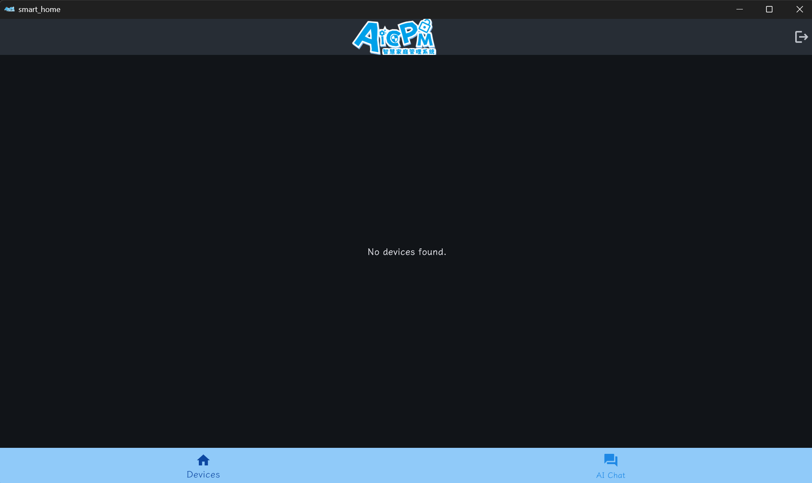

### 进入管理员界面，在管理用户的界面找到刚刚注册的新用户

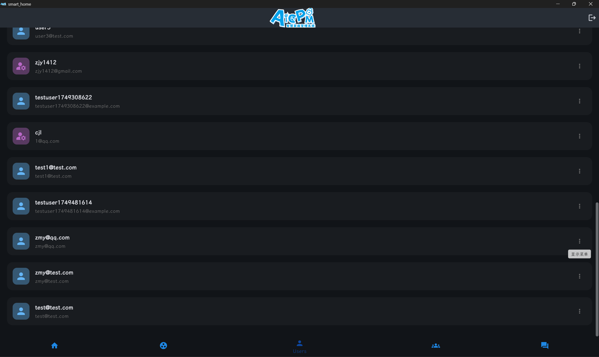

### 

### 对这个新用户，管理员赋予 ta 对客厅空调可见、对门锁可用、对智能冰箱可配置、对卧室台灯可监控、对监控摄像头可管理、对格力 0 度冰箱的可见权限

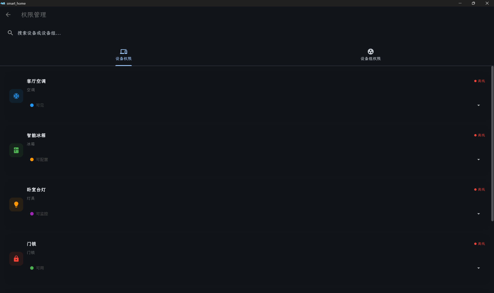

---

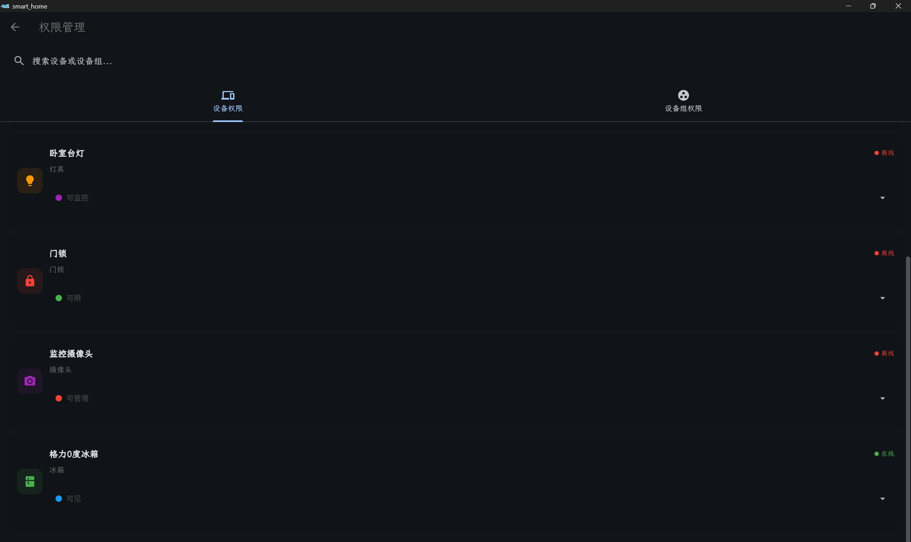

### 回到用户视角，在设备界面

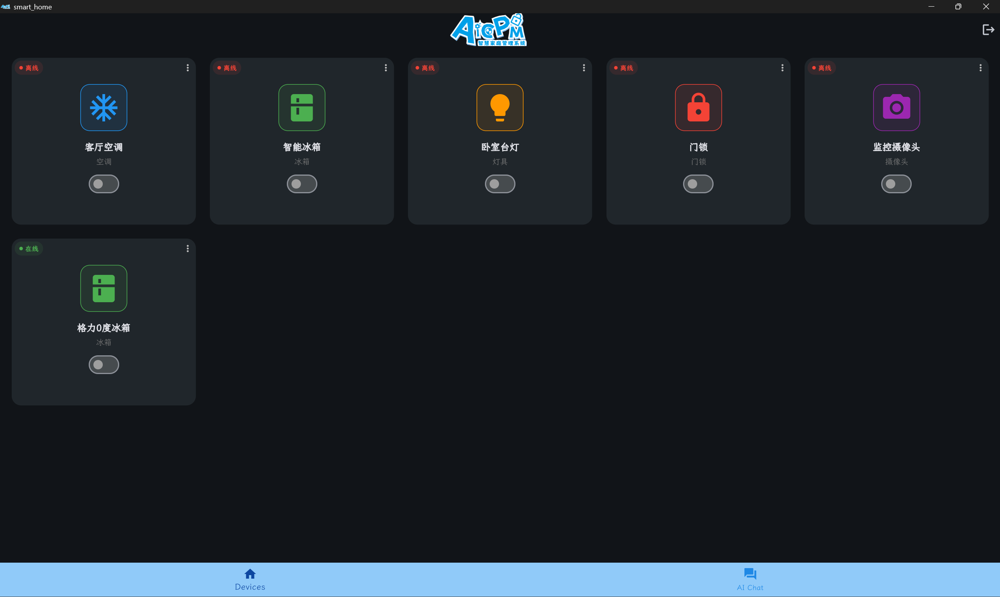

### 

### 用户查看客厅空调的信息，由于其对客厅空调的权限是可见，无法查看详细信息

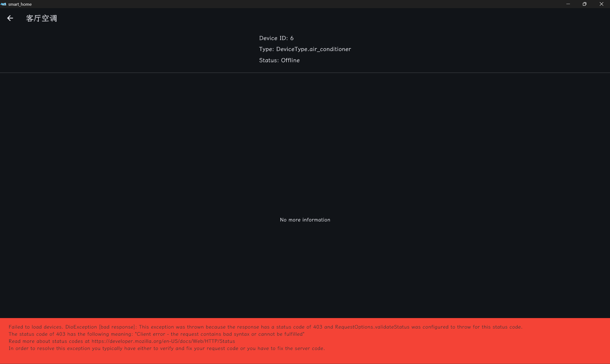

### 同理用户对智能冰箱和格力 0 度冰箱权限是可用，无法查看详细信息

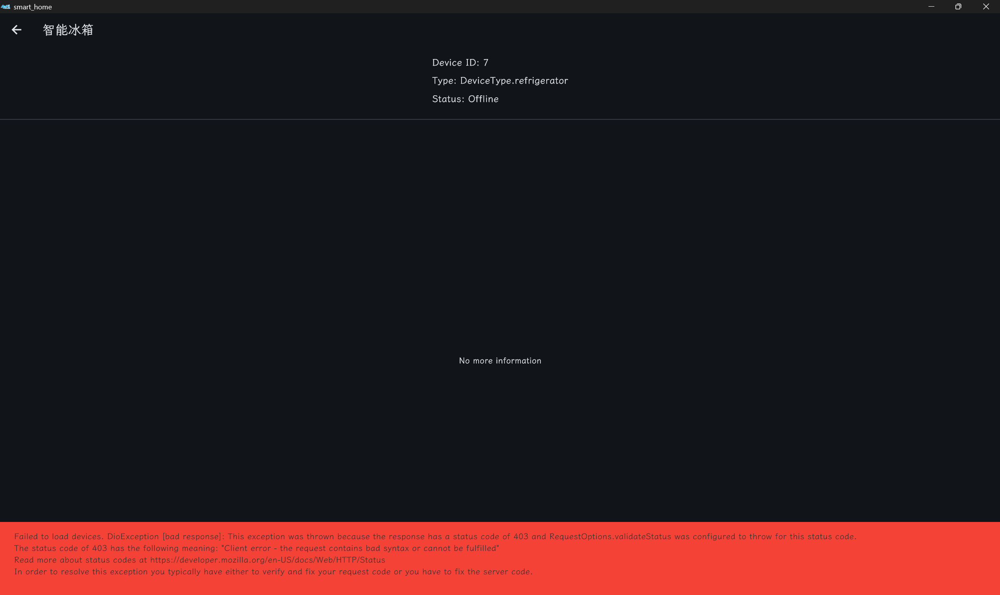

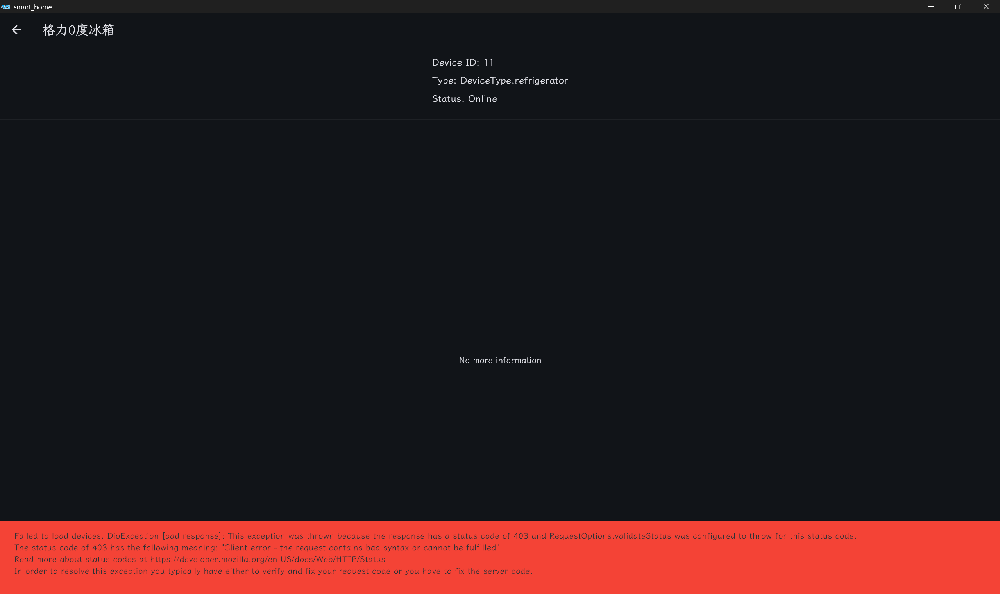

### 由于设备离线，无法对离线的设备进行开启和关闭操作，开关按钮按下无反应

### 使用 Gemini Chat，对于在线设备 格力 0 度冰箱，只有可见权限的用户无法查看信息和打开

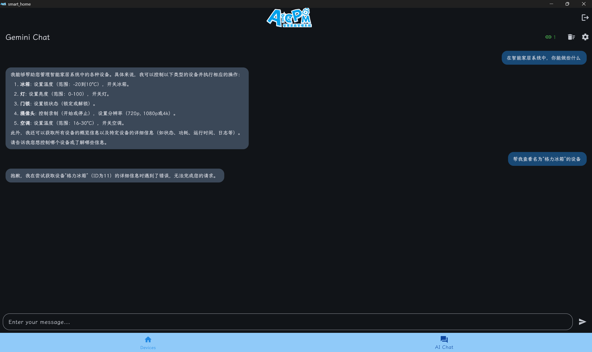

### 使用 Gemini Chat，对于可监控的卧室台灯

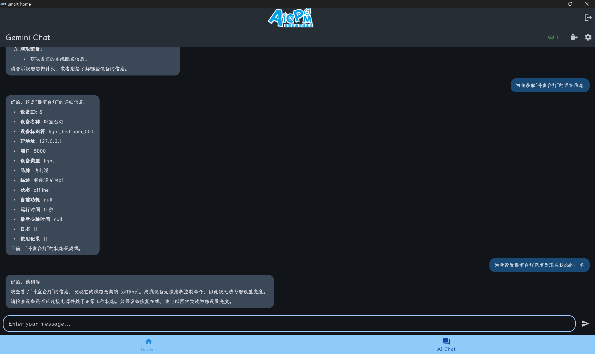

### 使用 Gemini Chat，识别用户对各个设备的权限，并遵守权限规则列出信息

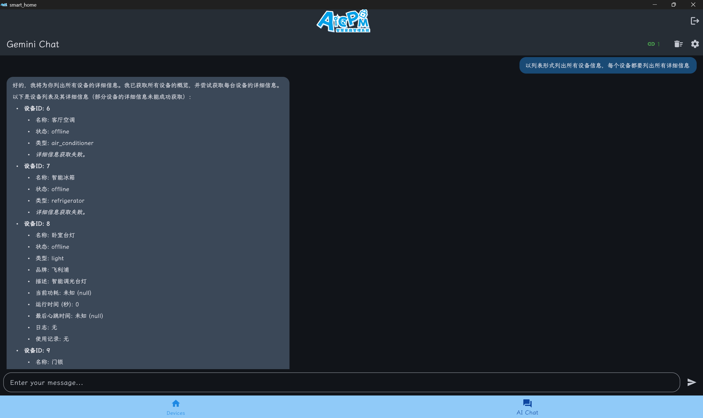

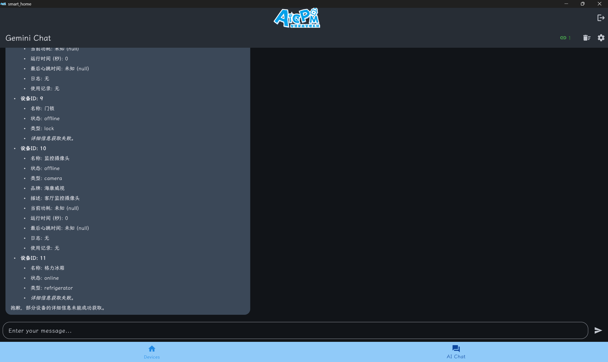

部分设备信息未能成功获取是正确的，符合权限规则

### 

## 管理员视角

- Gemini Chat 限定只能完成特定任务

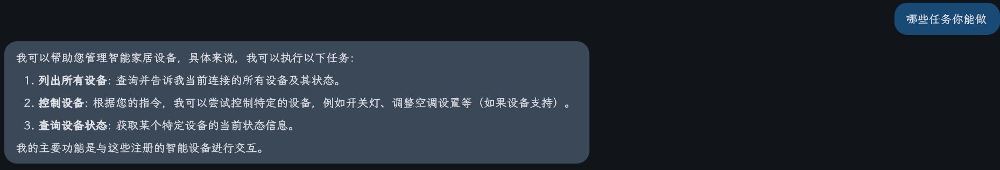

### 创建和管理用户组界面

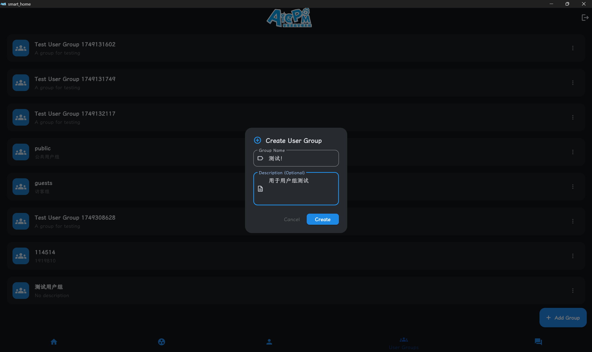

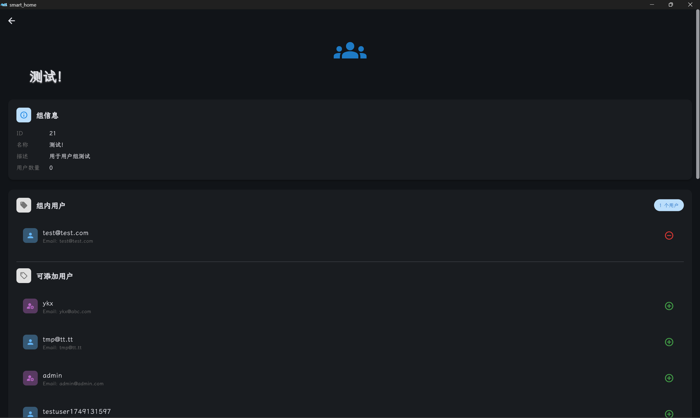

### 创建和管理设备组界面

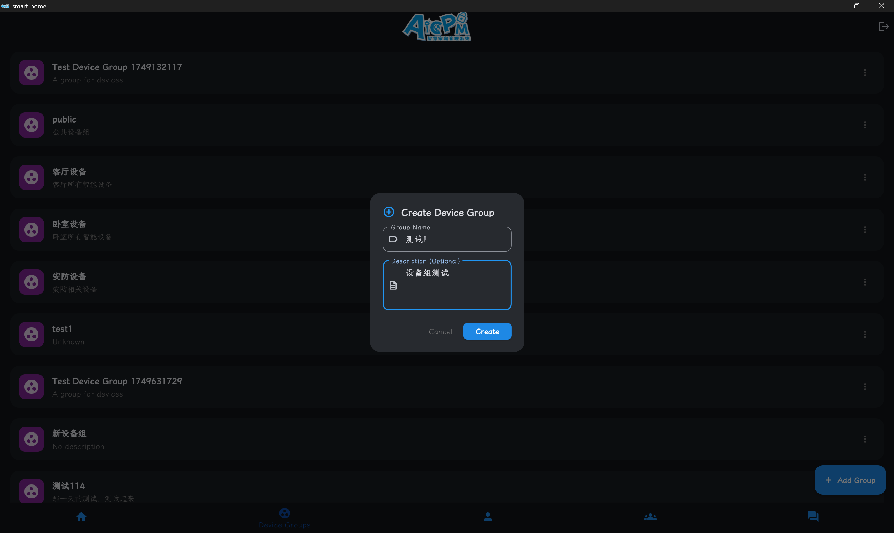

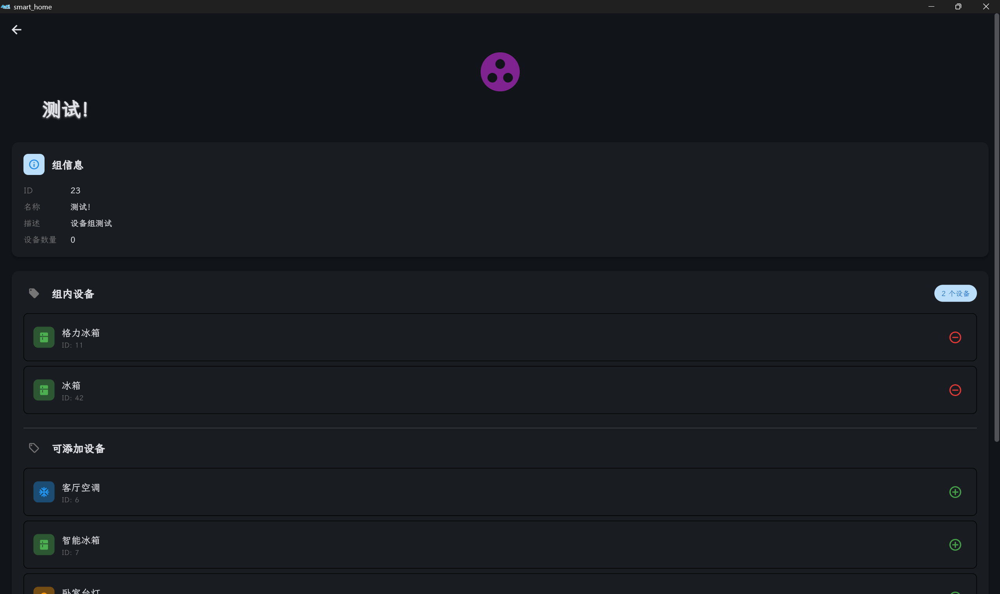

### 查询不同设备类型支持的操作和参数

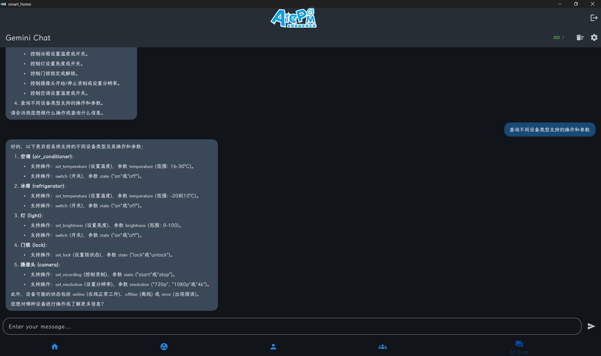
