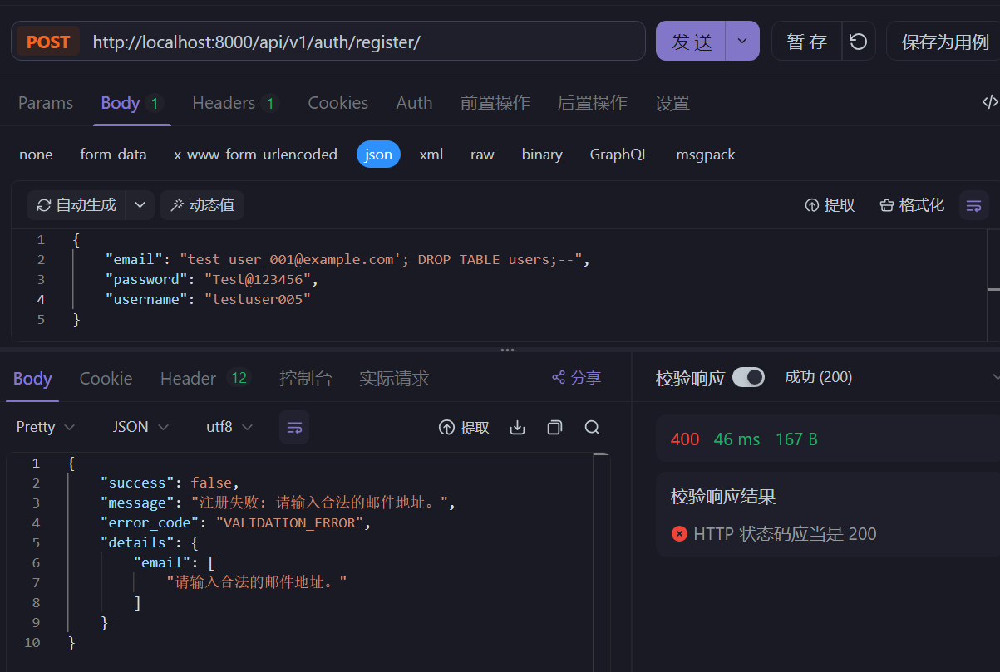

# 安全测试

进行常见的 http 漏洞检测，如可能存在的 SQL 注入和 XSS

## 注册

- 接口路径: `POST /auth/register`
- 请求体格式（其中名称不是必需项）:

```json
{
    "email": "test_user_001@example.com",
    "password": "Test@123456",
    "username": "testuser001"
}
```

### SQL 注入测试

#### 简单的 OR '1'='1 注入

```json
{
    "email": "' OR '1'='1",
    "password": "Test@123456",
    "username": "testuser001"
}
```

#### 尝试删除用户表

```json
{
    "email": "test_user_001@example.com'; DROP TABLE users;--",
    "password": "Test@123456",
    "username": "testuser001"
}
```



#### 使用注释符号绕过验证

```json
{
    "email": "test_user_001@example.com' --",
    "password": "Test@123456",
    "username": "testuser001"
}
```

### XSS 测试

#### 基本的 `<script>` 标签注入

```json
{
    "email": "<script>alert('xss')</script>@example.com",
    "password": "Test@123456",
    "username": "testuser001"
}
```

#### 更隐蔽的 XSS 攻击尝试

```json
{
    "email": "test<script>alert(1)</script>_user_001@example.com",
    "password": "Test@123456",
    "username": "testuser001"
}
```

#### 在用户名字段中注入 XSS 载荷

```json
{
    "email": "test_user_001@example.com",
    "password": "Test@123456",
    "username": "<script>alert('xss_in_username')</script>"
}
```

### 测试结果

- 经过测试，注册接口安全，无 SQL 注入风险和 XSS 脚本漏洞
- 返回体均如下：

```json
{
    "success": false,
    "message": "注册失败: 请输入合法的用户名。只能包含英文字母、数字、特殊字符“@”、“.”、“-”和“_”。",
    "error_code": "VALIDATION_ERROR",
    "details": {
        "username": [
            "请输入合法的用户名。只能包含英文字母、数字、特殊字符“@”、“.”、“-”和“_”。"
        ]
    }
}
```

- 同时后端查看数据库完整安全

这表明系统对于提供的恶意输入没有找到匹配的用户账户，并且始终返回相同的错误消息。这是一个好的迹象

## 登录

- 请求体可以直接套用上述注册的安全检测的 Json
- 经过自动测试，结果均为返回体提示报错，且数据库完好，网络状态稳定，所以该接口认为安全
- 返回体如下：

```json
{
    "success": false,
    "message": "找不到指定凭据对应的有效用户",
    "error_code": "no_active_account"
}
```
